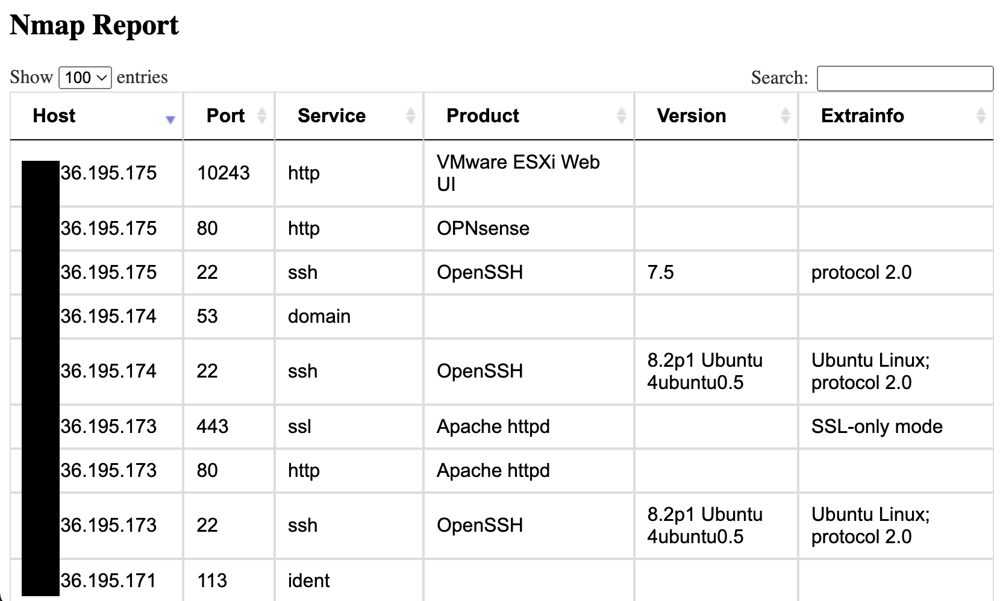

# nmap2html

A Python program that converts Nmap XML files to HTML format.



## Usage
```bash
python3 nmap2html.py --xml <nmap_input.xml> --html-output <report.html>
```
## Requirements

This program requires Python 3.

## How it works

The `nmap2html.py` script takes an Nmap XML file as input and generates an HTML report as output. The HTML report contains table with the target, found port and service details.

## License

This project is licensed under the MIT License - see the [LICENSE](LICENSE) file for details.
